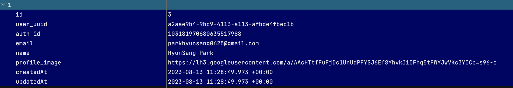

# passport-with-google
- Google OAuth2와 Passport.js를 통해서 사용자 인증 및 세션 구현을 하는 프로젝트입니다.
- 궁극적으로 OAuth2의 동작 원리 및 Passport.js의 동작 원리를 이해하고자 합니다.  

## 사용한 기술
- **Programming Language:** JavaScript
    - **Back-End Framework:** Node.js Exporess
    - **Auth:** Google OAuth2 + Passport.js
    - **ORM:** Sequelize
    - **Database:** SQLite

## init
### Create DataBase Model
```bash
$ sequelize model:generate --name User --attributes user_id:uuid,auth_id:string,email:string,name:string,profile_image:string

Sequelize CLI [Node: 20.5.1, CLI: 6.6.1, ORM: 6.32.1]

New model was created at /Users/park.hyunsang/dev/github/passport-with-google/models/user.js .
New migration was created at /Users/park.hyunsang/dev/github/passport-with-google/migrations/20230813084801-create-user.js 
```

### DataBase Migration
```bash
$ sequelize db:migrate

Sequelize CLI [Node: 20.5.1, CLI: 6.6.1, ORM: 6.32.1]

Loaded configuration file "config/config.json".
Using environment "development".
== 20230813084801-create-user: migrating =======
== 20230813084801-create-user: migrated (0.007s)
```

### Create User Data
```bash
Executing (default): INSERT INTO `Users` (`id`,`user_uuid`,`auth_id`,`email`,`name`,`profile_image`,`createdAt`,`updatedAt`) VALUES (NULL,$1,$2,$3,$4,$5,$6,$7);
User {
  dataValues: {
    id: 1,
    user_uuid: [class UUIDV4 extends ABSTRACT] { types: {}, key: 'UUIDV4' },
    auth_id: '103181970680635517988',
    name: 'HyunSang Park',
    email: 'parkhyunsang0625@gmail.com',
    profile_image: 'https://lh3.googleusercontent.com/a/AAcHTtfFuFjDc1UnUdPFYGJ6Ef8YhvkJiOFhq5tFWYJwVKc3YOCp=s96-c',
    updatedAt: 2023-08-13T08:59:30.990Z,
    createdAt: 2023-08-13T08:59:30.990Z
  },
  _previousDataValues: {
    user_uuid: [class UUIDV4 extends ABSTRACT] { types: {}, key: 'UUIDV4' },
    auth_id: '103181970680635517988',
    name: 'HyunSang Park',
    email: 'parkhyunsang0625@gmail.com',
    profile_image: 'https://lh3.googleusercontent.com/a/AAcHTtfFuFjDc1UnUdPFYGJ6Ef8YhvkJiOFhq5tFWYJwVKc3YOCp=s96-c',
    id: 1,
    createdAt: 2023-08-13T08:59:30.990Z,
    updatedAt: 2023-08-13T08:59:30.990Z
  },
  uniqno: 1,
  _changed: Set(0) {},
  _options: {
    isNewRecord: true,
    _schema: null,
    _schemaDelimiter: '',
    attributes: undefined,
    include: undefined,
    raw: undefined,
    silent: undefined
  },
  isNewRecord: false
}
```

